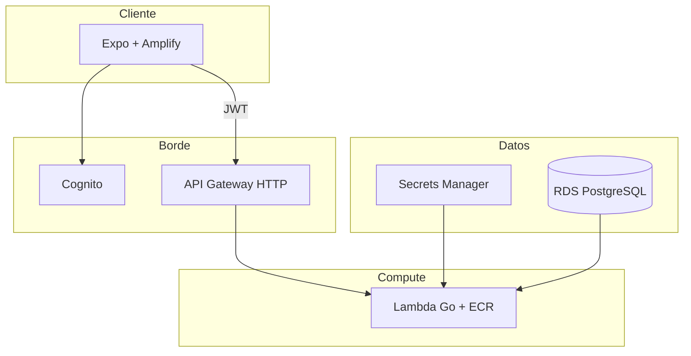
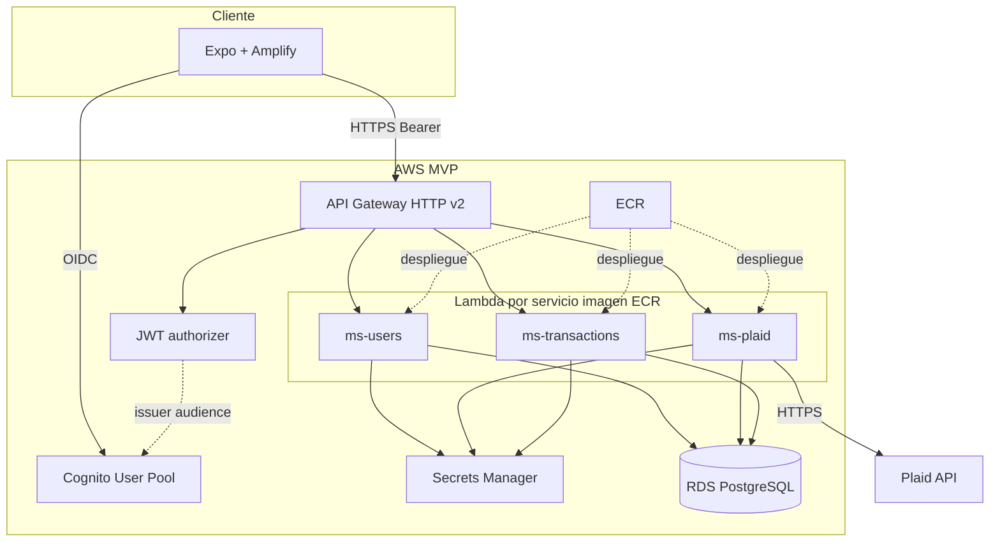
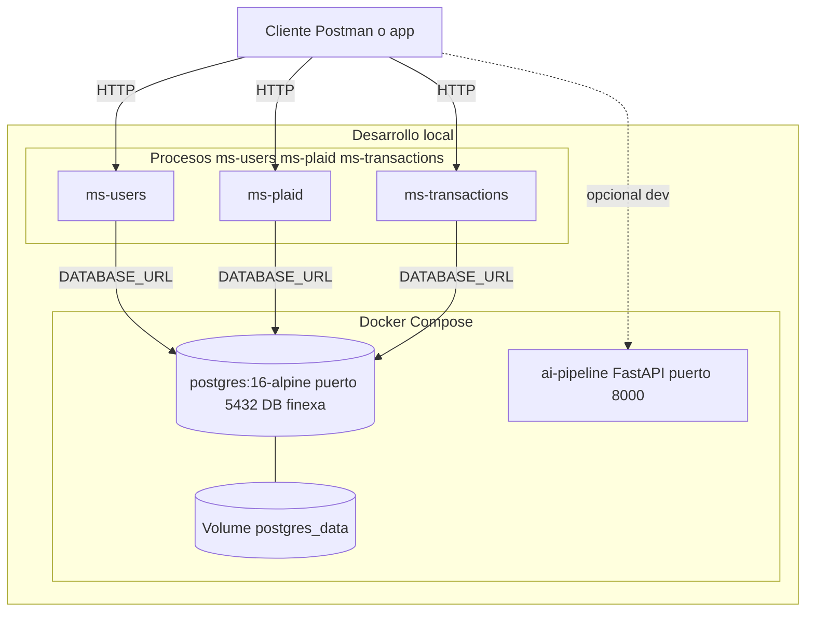
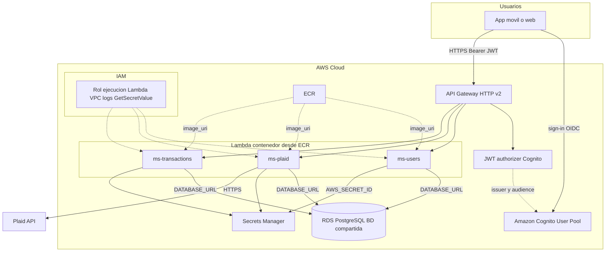

<div align="center">

<p align="center">
  
  &nbsp;&nbsp;&nbsp;&nbsp;
  
</p>
<sub>Equipo <strong>Team {Refactor;</strong> · proyecto <strong>Finexa IA</strong></sub>

**Resiliencia financiera proactiva para ingresos variables.**  
La plataforma combina datos bancarios agregados (Plaid), patrones de gasto y señales de comportamiento para anticipar tensiones de liquidez, detectar gastos hormiga y acompañar decisiones con contexto claro — sin sustituir el juicio del usuario.

Arquitectura **cloud-native** en **AWS**: backend **serverless** (API Gateway + Lambda en contenedores ECR), identidad y secretos como **servicios gestionados** (Cognito, Secrets Manager), datos en **RDS** opcional; la app móvil (Expo) es el cliente ligero frente a esa nube — sin servidores dedicados (EC2) ni orquestación propia 24/7 en el MVP.

[](https://expo.dev/)
[](https://reactnative.dev/)
[](https://go.dev/)
[](https://www.terraform.io/)
[](https://aws.amazon.com/)
[](https://aws.amazon.com/serverless/)

</div>

<p align="center">
  
  <br />
  <sub><a href="https://blog.wearedrew.co/que-son-los-ods-y-por-que-son-importantes-para-las-empresas-privadas">¿Qué son los ODS y por qué son importantes para las empresas privadas?</a> · imagen versionada en el repo para que cargue bien en GitHub.</sub>
</p>

## Objetivos de Desarrollo Sostenible (ODS)

**Track:** **ODS 8** — Trabajo decente y crecimiento económico.

**Aporte del proyecto:** Finexa IA vincula cuentas con **Plaid**, unifica movimientos y ofrece visibilidad frente a **ingresos variables** (freelance, gig, comisiones): anticipar tensiones de liquidez y detectar **gastos hormiga** para decidir con datos — no adivinando el mes a mes.

---

<p align="center">
  
  &nbsp;&nbsp;
  
  &nbsp;&nbsp;
  
</p>

## Arquitectura del sistema

La solución está pensada **nativa en la nube**: la API pública vive en **AWS** como **compute serverless** (Lambda), delante de **API Gateway**; la app solo orquesta UI y llamadas autenticadas — el “cerebro” operativo y el escalado están en **servicios gestionados**, no en máquinas virtuales mantenidas a mano.

### Decisiones (por qué · beneficio · impacto)

| Elección | Resumen |
|----------|---------|
| **Go + microservicios + API Gateway HTTP (v2) + Lambda + ECR** | **Por qué:** patrón **serverless**: sin servidor aprovisionado; Go liviano en Lambda; `ms-users` / `ms-plaid` / `ms-transactions` separan dominios; misma imagen en CI y ECR. **Beneficio:** despliegues y tests por servicio; coste por uso (pago por invocación). **Impacto:** Plaid y salud financiera sin que un fallo tumbe todo el backend. |
| **Expo + React Native + expo-router** | **Por qué:** un codebase iOS/Android/web y rutas por archivos. **Beneficio:** menos mantenimiento que tres nativos; Plaid Link SDK. **Impacto:** el usuario vincula cuentas y ve señales de gasto en una sola app. |
| **Cognito + JWT + Amplify** | **Por qué:** **IdP y tokens gestionados** en la nube; validación JWT en API Gateway; Amplify en cliente. **Beneficio:** cero auth server propio. **Impacto:** identidad alineada con datos bancarios y perfil interno. |
| **PostgreSQL (Docker / RDS)** | **Por qué:** relacional con FK entre `users` y Plaid. **Beneficio:** local con Docker; RDS en cloud. **Impacto:** datos coherentes para liquidez y auditoría de link. |
| **Terraform** | **Por qué:** infra como código (véase [`infra/README.md`](infra/README.md)). **Beneficio:** menos consola manual. **Impacto:** MVP reproducible y evolución a piloto sin rediseñar despliegue. |

### Eficiencia y optimización

- **Modelo serverless:** la API no corre en VMs fijas; **Lambda** escala con la demanda y a cero si no hay tráfico.
- **API Gateway + prefijos:** un frente HTTP gestionado, CORS simple, rutas calientes estables.
- **Docker CI = ECR:** misma imagen en pipeline y runtime; menos “funciona en mi máquina”.
- **Una API tras Cognito:** menos round-trips y orígenes en el móvil; secretos vía **Secrets Manager** en la nube, no en el cliente.

### Vista lógica (referencia)



_En API Gateway (MVP): `GET {prefijo}/health` es público; las rutas `ANY {prefijo}/{proxy+}` usan **authorizer JWT** (issuer de Cognito, audience del app client)._

### Diagrama de componentes (referencia)



_La capa **ai-pipeline** (FastAPI, ver `backend/docker-compose.yml`) no está desplegada en el MVP Terraform actual; corre en local/Docker y se integra vía `POST http://localhost:8000` desde la app o Postman. El despliegue AWS es parte del roadmap._

### Despliegue local (Docker + procesos Go)

`docker compose` levanta Postgres y, opcionalmente, **ai-pipeline**; los microservicios Go se arrancan con `make run SVC=...` y leen `.env` por servicio ([`backend/docker-compose.yml`](backend/docker-compose.yml)).



Por defecto cada servicio escucha en **8080**; para ejecutar **varios a la vez**, define **`HTTP_PORT`** distinto en el `.env` de cada uno (por ejemplo 8080, 8081, 8082). **ai-pipeline** no sustituye a los `ms-*` en el flujo móvil salvo que el cliente apunte explícitamente a ese host.

### Despliegue AWS + Cognito (MVP)

Rutas con prefijo `/ms-users`, `/ms-plaid`, `/ms-transactions` detrás de API Gateway; secretos vía **Secrets Manager** cuando `AWS_SECRET_ID` / `MICROSERVICES_SECRET_ARN` está definido; usuarios canónicos por **sub** de Cognito en Postgres.


---

<p align="center">
  
  &nbsp;&nbsp;
  
  &nbsp;&nbsp;
  
  &nbsp;&nbsp;
  
</p>

## Stack tecnológico

| Capa | Tecnología | Rol |
|------|------------|-----|
| **Front-end** | Expo ~54, React Native, React 19, TypeScript, expo-router | App multiplataforma, navegación y UI. |
| **Front-end** | AWS Amplify (`@aws-amplify/react-native`, `aws-amplify`) | Sesión y flujo con Cognito. |
| **Front-end** | axios, react-native-plaid-link-sdk | HTTP tipado y flujo Plaid Link. |
| **Back-end** | Go 1.25, Echo v5, Uber FX | APIs HTTP, inyección de dependencias y ciclo de vida. |
| **Back-end** | sqlc, `database/sql`, PostgreSQL | Acceso a datos tipado y migraciones por servicio. |
| **Back-end** | swaggo / OpenAPI generado | Contrato y documentación de endpoints. |
| **Paquete compartido** | [`backend/pkg/apiresult`](backend/pkg/apiresult) | Respuestas y manejo de errores HTTP coherentes. |
| **Integración** | Plaid API (sandbox / producción según entorno) | Agregación bancaria y tokens vía `ms-plaid`. |
| **Datos** | PostgreSQL 16 (Docker local; RDS en cloud) | Persistencia transaccional única entre microservicios acoplados por esquema. |
| **IA / datos** | Python en [`models/`](models/) | Scripts de preparación de datos y pruebas contra entornos Plaid (no sustituyen inferencia en producción). |
| **AI Pipeline** | FastAPI, Python, AWS Bedrock (Claude Sonnet), AWS SageMaker (XGBoost) | Servicio de inteligencia financiera: clasificación de transacciones, análisis conductual, score de resiliencia ML, plan de accion para sugerencias y Modo Supervivencia. |
| **Infraestructura** | Terraform, VPC, ECR, API Gateway, Lambda, Cognito | **Cloud-native** en AWS: API **serverless** (Lambda), red y auth gestionados. |
| **Infraestructura** | Secrets Manager, CloudWatch (+ SNS opcional) | Secretos rotados fuera del repo; logs y alertas. |
| **CI/CD** | GitHub Actions ([`.github/workflows/backend-lambda.yml`](.github/workflows/backend-lambda.yml)) | Tests Go, build de imágenes en PR, despliegue controlado a `main`. |

---

<p align="center">
  
  &nbsp;&nbsp;
  
</p>

## Calidad de código y estándares

### Estrategia de branching

Se adopta un enfoque cercano a **trunk-based development**: la rama **`main`** concentra la integración continua y el código listo para release. Los cambios entran por **pull request**; el workflow en `.github/workflows/backend-lambda.yml` se dispara con cambios bajo `backend/**` (y el propio workflow). En **push a `main`**, el despliegue a **ECR** y actualización de **Lambda** exige **aprobación manual** del entorno `aws-lambda-deploy` — no es GitFlow clásico (sin ramas `release/*` obligatorias); la disciplina está en revisiones, tests (`make test-all`) y control explícito del pipeline productivo.

### Observabilidad y errores

- **Logging:** `log/slog` hacia stdout; en Lambda los eventos se concentran en **Amazon CloudWatch Logs** para correlación por request.
- **HTTP:** middleware de **Echo** para registro de peticiones y **Recover** para aislar pánics; manejador de errores centralizado vía **apiresult** para respuestas predecibles.
- **Salud:** endpoints de health y readiness según el patrón de cada servicio (p. ej. `/ready` documentado en los README de `ms-*`).
- **Infra:** alarmas métricas y **SNS** opcionales en Terraform para señalizar degradación o umbrales operativos.

### Mantenibilidad

Arquitectura en capas por servicio — **handlers → services → repository** (código generado con **sqlc**), configuración explícita y **FX** para composición. Los contratos HTTP quedan descritos con **Swagger**; el paquete **apiresult** evita duplicar formatos de error y facilita evolucionar la API sin romper clientes.

---

## Modelos de IA e integraciones

### Plaid y flujo de datos

1. El usuario inicia **Plaid Link** en la app (SDK nativo).
2. **`ms-plaid`** emite **link tokens**, intercambia **public tokens** y persiste metadatos de ítems sin exponer secretos al cliente.
3. **PostgreSQL** mantiene la relación usuario ↔ conexión Plaid de forma consistente con **`ms-users`** (identidad anclada a Cognito).
4. **`ms-transactions`** concentra el dominio de movimientos según el alcance desplegado del proyecto.

Este diseño permite sincronizar y consultar datos financieros con latencia acotada por la red y el backend serverless, priorizando rutas síncronas para operaciones interactivas y dejando espacio a procesos asíncronos o por lotes en evoluciones futuras.

### AI Pipeline — arquitectura e implementación

El directorio [`ai-pipeline/`](ai-pipeline/) contiene un servicio **FastAPI** que expone la inteligencia financiera de Finexa. Acepta transacciones en **formato Plaid** y produce clasificación, insights conductuales, score de resiliencia ML, proyección de cash flow y simulaciones hipotéticas.

#### Endpoints y pipeline (Steps A → E + extras)

| Endpoint | Step | Descripción |
|----------|------|-------------|
| `POST /classify` | **A** | Clasifica transacciones con la cadena **caché → heurísticas → Bedrock**. Solo las transacciones ambiguas llegan al LLM. |
| `POST /analyze` | **A + B + C + D** | Pipeline completo: clasificación + análisis conductual (insights) + score de resiliencia + explicación LLM + cash flow + daily pulse. Steps B y C corren en paralelo con `asyncio.gather`. |
| `POST /cashflow` | **Radar** | Detección de gastos recurrentes, proyección de liquidez a 30 días, alertas de Día de Riesgo y detección de ráfagas de gasto impulsivo. Más rápido que `/analyze` (omite B y C). |
| `POST /whatif` | **Simulador** | Simula cómo cambia el Score de Resiliencia y la liquidez proyectada al modificar hábitos o ingresos. Análisis diferencial vía Bedrock. |
| `POST /insights/action-plan` | **E** | Recibe un insight de `/analyze` y devuelve un plan de 2–4 pasos concretos (cancelar suscripción, sustituir gasto hormiga, configurar ahorro automático, etc.). |
| `POST /survival-mode` | **Supervivencia** | Simula el escenario de recorte brusco: elimina gastos hormiga, suscripciones, entretenimiento y variables; conserva renta, comida, salud y transporte. Devuelve ahorro mensual proyectado, runway y desglose por categoría. **Sin Bedrock — cálculo puro.** |

#### Cadena de clasificación (Step A)

```
Transacción Plaid
       │
       ▼
  ┌─────────┐    hit     ┌─────────────────────┐
  │  Caché  │──────────▶│ EnrichedTransaction  │
  └────┬────┘           │  source: "cache"     │
       │ miss           └─────────────────────┘
       ▼
  ┌───────────┐   hit    ┌─────────────────────┐
  │Heurísticas│─────────▶│  source: "heuristic" │
  └─────┬─────┘          └─────────────────────┘
        │ ambigua
        ▼
  ┌──────────────────────────────────┐
  │  Bedrock (Claude Sonnet) Tool Use│  batches en paralelo
  └──────────┬───────────────────────┘
             │ ok            │ fallo
             ▼               ▼
      source:"bedrock"  source:"fallback"
```

#### Score de Resiliencia Financiera — Modelo ML (XGBoost en SageMaker)

El score (0–100) se predice con un endpoint **XGBoost** desplegado en **Amazon SageMaker**, entrenado sobre 10 000 usuarios simulados en tres arquetipos:

| Arquetipo | Descripción |
|-----------|-------------|
| **El Estable** (40 %) | Alto ahorro, gastos fijos bajos, baja variabilidad de ingresos |
| **El Freelancer Volátil** (40 %) | Ahorro irregular, fijos medios, alta variabilidad de ingresos |
| **El Sobrendeudado** (20 %) | Sin ahorro, fijos al límite del ingreso |

Los **5 features** enviados al endpoint (en este orden exacto, como CSV):

| Feature | Escala | Dirección |
|---------|--------|-----------|
| `ratio_ahorro` | 0–100 % del ingreso ahorrado | Mayor = mejor |
| `control_fijos` | 0–100 % del ingreso en gastos fijos | Menor = mejor |
| `frec_hormiga` | 0–100 % del gasto total en hormiga | Menor = mejor |
| `var_ingresos` | 0–100 % de variación ingreso obs. vs declarado | Menor = mejor |
| `runway` | 0–12 meses de gastos cubiertos por ahorro | Mayor = mejor |

**Target de entrenamiento** (fórmula heurística + ruido gaussiano σ=5):

```
score = ratio_ahorro × 0.30
      + (100 − control_fijos) × 0.25
      + (100 − frec_hormiga)  × 0.20
      + (100 − var_ingresos)  × 0.15
      + (runway / 12 × 100)   × 0.10
      + N(0, 5)                          # ruido estadístico
```

Entrenamiento: **XGBoost 1.5-1** (`objective=reg:squarederror`, `max_depth=5`, `eta=0.2`, `num_round=100`) en instancia `ml.m5.xlarge`; inferencia en `ml.t2.medium`.

**Niveles del score:**

| Rango | Nivel |
|-------|-------|
| ≥ 75 | `resiliente` |
| 50–74 | `estable` |
| 25–49 | `vulnerable` |
| < 25 | `frágil` |

Si el endpoint SageMaker no está disponible, el servicio **cae automáticamente** a la misma fórmula heurística ponderada como respaldo.

#### Integraciones AWS

| Servicio | Uso |
|----------|-----|
| **AWS Bedrock** (Claude Sonnet) | Clasificación de transacciones ambiguas, análisis conductual con insights, explicación personalizada del score de resiliencia, análisis diferencial What-If, planes de acción por insight |
| **AWS SageMaker** | Endpoint XGBoost para predicción del Score de Resiliencia Financiera |

Todos los bloques que invocan Bedrock o SageMaker tienen **fallback determinístico** (heurísticas o plan de respaldo) para que la API siempre devuelva una respuesta útil.

---

<p align="center">
  
  &nbsp;&nbsp;
  
</p>

## Guía de instalación

### Requisitos previos

- **Node.js** y npm (para la app Expo).
- **Go 1.25** y **Docker** (para backend local e imágenes Lambda).
- **Terraform ≥ 1.5** y **AWS CLI** (para infraestructura y despliegue).

### Aplicación móvil

```bash
cd app/finexa-ia
npm install
npx expo start
```

Configurar variables públicas de entorno según tu despliegue (por convención Expo, p. ej. `EXPO_PUBLIC_*`) para la URL base del API, el pool de Cognito y demás valores que exponga [`infra/README.md`](infra/README.md) tras `terraform apply`.

### Backend local (PostgreSQL + servicio)

```bash
cd backend
docker compose up -d
```

Aplicar migraciones y generar código **sqlc** según el README de cada servicio bajo `backend/services/ms-*`. Arrancar un microservicio:

```bash
make run SVC=ms-plaid
```

Definir `DATABASE_URL` (y secretos Plaid) apuntando al Postgres local (`localhost:5432`, usuario/contraseña según [`backend/docker-compose.yml`](backend/docker-compose.yml)).

### Infraestructura (AWS)

Seguir la guía detallada en **[`infra/README.md`](infra/README.md)** (bootstrap de estado remoto S3/DynamoDB, `terraform init`, `terraform apply`, checklist de Cognito, ECR y secretos).

### Despliegue de Lambdas (ECR)

Con credenciales AWS válidas y repositorios ECR creados por Terraform:

```bash
cd backend
make lambda-deploy
```

Variables típicas: `AWS_REGION`, `LAMBDA_PROJECT`, `LAMBDA_ENV`, `TAG_SHA` (ver [`backend/Makefile`](backend/Makefile)).

---

## Roadmap y mejoras futuras

- Desplegar **ai-pipeline** en AWS (ECS Fargate o Lambda container) para que la app móvil consuma los endpoints de IA en producción con las mismas garantías de seguridad (Cognito + API Gateway) que los microservicios Go.
- Reentrenar el modelo XGBoost con datos reales de usuarios en lugar del dataset simulado.
- Profundizar categorización de comercios y series temporales sobre el histórico ya almacenado.
- Notificaciones proactivas (push / email) gobernadas por preferencias del usuario.
- Pruebas de carga sobre API Gateway + Lambda y ajuste de memoria/concurrencia reservada donde el presupuesto lo permita.
- Trazas distribuidas (p. ej. AWS X-Ray) para depurar latencias extremo a extremo.

---

## Estructura del monorepo (referencia)

```
finexa-ia/
├── app/finexa-ia/          # Cliente Expo / React Native
├── ai-pipeline/            # FastAPI — IA financiera (Bedrock + SageMaker); ver docker-compose en backend
├── backend/
│   ├── pkg/apiresult/      # Utilidades HTTP compartidas
│   ├── services/
│   │   ├── ms-plaid/
│   │   ├── ms-transactions/
│   │   └── ms-users/
│   ├── docker-compose.yml
│   └── Makefile
├── infra/                  # Terraform (MVP)
├── models/                 # Scripts Python (datos / sandbox)
└── docs/                   # Logos, vista-logica.svg, assets de marca
```

---

## Documentación adicional

- [Infraestructura Terraform — MVP](infra/README.md)
- [API HTTP + Lambdas (módulo)](infra/modules/http-api-lambdas/README.md)
- [ms-users](backend/services/ms-users/README.md)
