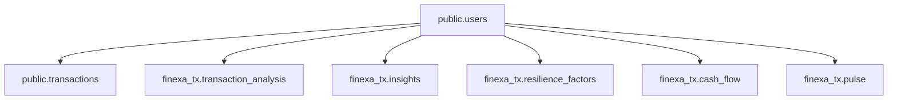

# Requerimientos de API — ms-transactions

Documento orientado a desarrolladores que implementen endpoints para la app móvil sobre el modelo de datos actual. La fuente de verdad del esquema es [`sql/schema.sql`](sql/schema.sql) y las migraciones en [`migrations/`](migrations/).

---

## Contexto de la base de datos

- **Una sola base PostgreSQL** compartida con `ms-users` y `ms-plaid` (misma `DATABASE_URL` en entornos).
- **`public.users`**: identidad (Cognito). El `id` numérico interno es la clave que usa el resto de tablas.
- **`public.transactions`**: movimientos del usuario. Incluye columnas MVP (`amount_cents`, `currency`, `description`, `posted_at`, `external_id`, …) y columnas ampliadas para Plaid/IA (`transaction_id`, `name`, `merchant_name`, `amount`, etc.). Unicidad cuando exista `transaction_id`: `(user_id, transaction_id)` con `transaction_id IS NOT NULL`.
- **Schema `finexa_tx`**: tablas de dominio agregado — `transaction_analysis`, `insights`, `resilience_factors`, `cash_flow`, `pulse`. Todas referencian `public.users(id)` mediante `user_id`. **No hay FK a `transactions`**: son agregados o snapshots por usuario, no una fila por transacción.

---

## Modelo de relaciones

- Todo el acceso a datos debe ser **por usuario autenticado**: el `user_id` se obtiene del **JWT (Cognito)** en el backend; no exponer datos cruzando usuarios por `user_id` en query params sin validación.

---

## Joins y consultas

| Tabla | Relación | Notas |
|----------|----------|--------|
| `transactions` | `users` | `user_id → users(id)` |
| `finexa_tx.*` | `users` | `user_id → users(id)` |
| Entre tablas `finexa_tx` | Sin FK entre ellas | No hay join obligatorio en SQL; un “dashboard” puede ser 5 lecturas por `user_id` o un endpoint que componga JSON. |
| `transactions` ↔ `finexa_tx` | No modelado en BD | Cualquier vínculo semántico (ej. categoría) es lógica de aplicación. |

**Snapshots “último estado”**: si el negocio define un solo resumen vigente por usuario, usar `ORDER BY updated_at DESC` o `created_at DESC` con `LIMIT 1` y `deleted_at IS NULL` donde aplique.

---

## Requerimientos funcionales sugeridos (endpoints)

Ajustar prefijos y rutas al estándar del proyecto (`/v1/...`, API Gateway, Cognito).

1. **Transacciones**
   - Listado paginado del usuario autenticado; filtros por rango de fechas, categoría; excluir borrados lógicos por defecto (`deleted_at IS NULL`).
   - Detalle por `id` interno o por `transaction_id` (definir contrato).

2. **Análisis agregado**
   - Lectura de `transaction_analysis` (último y/o histórico según producto).
   - Lista de `insights` con paginación si hay muchas filas.

3. **Resiliencia**
   - Lista de filas en `resilience_factors` para el usuario (p. ej. un factor por fila).

4. **Cash flow y pulse**
   - Lectura del último `cash_flow` y del último `pulse` según reglas de negocio (fecha de referencia / `updated_at`).

5. **Seguridad**
   - Toda query lleva implícito `WHERE user_id = <id resuelto del token>`.
   - No confiar en `user_id` enviado por el cliente para datos sensibles.

---

## Patrones de búsqueda SQL (referencia)

- Transacciones por rango: filtrar por `user_id`, `posted_at` (o `date`/`datetime` cuando estén poblados), `deleted_at IS NULL`.
- Último snapshot: `user_id` + orden temporal + `LIMIT 1`.
- Índices existentes: ver `sql/schema.sql` (`idx_transactions_user_id`, índices `*_user_id` en `finexa_tx`).

---

## Entregables técnicos

- Handlers y capa de datos en este microservicio (o capa acordada con arquitectura).
- Tests que verifiquen **aislamiento de usuario** (usuario A no accede a datos de B).
- Documentación Swagger (`swag`) alineada con el resto del backend.
- Contrato JSON acordado con el cliente móvil (naming camelCase vs snake_case).

---

## Limitación

Las tablas en `finexa_tx` **no** enlazan fila a fila con `transactions`. Si un insight debe mostrar transacciones concretas, hará falta lógica adicional o evolución del modelo en el futuro.

---

## Orden de migraciones (misma BD)

Si se despliega desde cero: `ms-users` → `ms-transactions` → `ms-plaid`. Ver comentario en [`Makefile`](Makefile).
