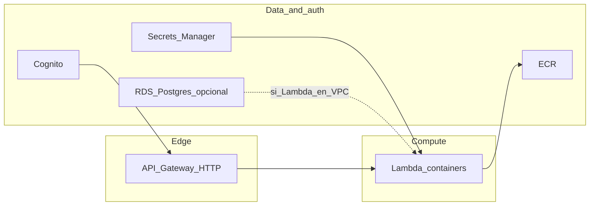

# Infraestructura AWS (Terraform) — guía de lanzamiento MVP

Este directorio contiene la definición en Terraform del entorno **MVP**: red, contenedores (ECR), autenticación (Cognito), API HTTP (API Gateway v2) con Lambdas en contenedor, secretos compartidos (Secrets Manager), base de datos opcional (**RDS PostgreSQL** en la VPC) y observabilidad opcional (CloudWatch + SNS).

## Arquitectura (orden de creación lógico)

Los recursos se declaran en [`environments/mvp/main.tf`](environments/mvp/main.tf):

| Componente | Rol |
|------------|-----|
| **VPC** | Subnets públicas/privadas, IGW, NAT opcional. |
| **ECR** | Un repositorio por clave en `ecr_services`. |
| **Cognito** | User pool + app client (JWT para API Gateway). |
| **Secrets Manager** | Secreto JSON compartido para todas las Lambdas (opcional). |
| **RDS PostgreSQL** | Instancia en subnets privadas (opcional; `enable_rds_postgres`). |
| **HTTP API + Lambdas** | API Gateway HTTP v2, rutas por prefijo por microservicio, imágenes desde ECR. |
| **CloudWatch** | Alarmas métricas + SNS + dashboard opcional (opcional). |

Las variables **`enable_http_api`**, **`lambda_http_services`**, **`lambda_attach_to_vpc`** y **`lambda_vpc_security_group_ids`** están declaradas en [`environments/mvp/locals.tf`](environments/mvp/locals.tf) junto con el `locals` que fusiona ECR, memoria, timeout y `MICROSERVICES_SECRET_ARN` cuando existen secretos.



## Prerrequisitos

- **Terraform** `>= 1.5.0` (ver [`environments/mvp/versions.tf`](environments/mvp/versions.tf)).
- **AWS CLI** configurado y credenciales IAM con permisos para crear los recursos anteriores.
- Región coherente con la variable `aws_region` (por defecto `us-east-1` en [`environments/mvp/variables.tf`](environments/mvp/variables.tf)).

## Paso 0: Bootstrap (una vez por cuenta / proyecto raíz)

El estado remoto (S3 + bloqueo DynamoDB) se crea en [`bootstrap/`](bootstrap/). Ese stack usa **backend local** (ver [`bootstrap/main.tf`](bootstrap/main.tf)).

1. `cd infra/bootstrap`
2. `terraform init`
3. `terraform apply`
4. Anotar los outputs (bucket de estado, tabla de locks, account id) desde [`bootstrap/outputs.tf`](bootstrap/outputs.tf).
5. Copiar [`environments/mvp/backend.hcl.example`](environments/mvp/backend.hcl.example) a `environments/mvp/backend.hcl` y sustituir `ACCOUNT_ID` y valores según los outputs.
6. **No** subir `backend.hcl` al repositorio si contiene datos sensibles o políticas internas; usar `.gitignore` según corresponda.

Inicialización del entorno MVP:

```bash
cd infra/environments/mvp
terraform init -backend-config=backend.hcl
```

## Paso 1: Desplegar el entorno MVP

```bash
cd infra/environments/mvp
terraform plan
terraform apply
```

- El proveedor AWS aplica **tags por defecto** (`Project`, `Environment`, `ManagedBy`) definidos en [`environments/mvp/provider.tf`](environments/mvp/provider.tf).
- Tras el apply, revisa [`environments/mvp/outputs.tf`](environments/mvp/outputs.tf): URL del API, IDs de Cognito, URLs de ECR, endpoint de RDS (si aplica), ARN del topic SNS, ARN del secreto compartido, etc.

### Imágenes Docker (antes o después del primer apply de Lambdas)

Las Lambdas esperan una imagen en ECR con el tag configurado (`image_tag`, por defecto `latest` en el `locals`). El flujo típico es **build → push a ECR →** `terraform apply` (o actualizar el tag en `lambda_http_services`). Detalle de rutas y prefijos: [`modules/http-api-lambdas/README.md`](modules/http-api-lambdas/README.md).

## Checklist previo al lanzamiento

| Tema | Qué revisar |
|------|-------------|
| **Cognito** | `cognito_domain_prefix` único en la región/cuenta; `cognito_callback_urls` y `cognito_logout_urls` alineados con la app (p. ej. Expo / React Native). |
| **ECR ↔ Lambdas** | Cada clave de `lambda_http_services` debe existir en `ecr_services`; subir imagen con el **mismo tag** que uses en Terraform. |
| **Secrets Manager** | Si `enable_app_secrets` es `true`, completar el JSON del secreto compartido en la consola de AWS tras el primer apply (el módulo ignora cambios posteriores del string en Terraform). Las Lambdas reciben `MICROSERVICES_SECRET_ARN` vía [`locals.tf`](environments/mvp/locals.tf). |
| **RDS** | Con `enable_rds_postgres`, el módulo exige al menos `postgres_allowed_security_group_ids` o `postgres_allowed_cidr_blocks` (si ambos están vacíos, se usa el CIDR de la VPC). Para Lambdas en VPC: `lambda_attach_to_vpc = true`, SGs correctos y **NAT** (o endpoints VPC) para salida a internet (p. ej. Secrets Manager). |
| **Coste** | NAT Gateway, instancia RDS, retención de backups, alarmas CloudWatch estándar. |
| **Cuenta / IAM** | Revisar valores por defecto que asuman otra cuenta (p. ej. rol SNS de Cognito en `variables.tf`) si despliegas en otra cuenta AWS. |

## Checklist posterior al apply

- **SNS**: si configuraste `cloudwatch_alarm_email`, abrir el correo de **Confirm subscription** del topic de alertas.
- **App cliente**: mapear outputs de Cognito y la URL base del API a variables de entorno públicas (p. ej. `EXPO_PUBLIC_*` en la app).
- **API**: probar `GET {prefijo}/health` (sin JWT) y rutas bajo `ANY {prefijo}/{proxy+}` con `Authorization: Bearer <token>` de Cognito.
- **CloudWatch**: abrir el dashboard si `enable_cloudwatch_dashboard` está activo (nombre en outputs).

## Variables y flags (referencia rápida)

Definidas principalmente en [`environments/mvp/variables.tf`](environments/mvp/variables.tf) y en [`environments/mvp/locals.tf`](environments/mvp/locals.tf). Puedes sobreescribirlas con `terraform.tfvars` (idealmente fuera de control de versiones si incluyen datos sensibles).

| Área | Variables / flags |
|------|-------------------|
| **Proyecto / región** | `project`, `environment`, `aws_region` |
| **Red** | `vpc_cidr`, `vpc_az_count`, `vpc_enable_nat_gateway` |
| **ECR** | `ecr_services`, `ecr_image_retention_count` |
| **Cognito** | `cognito_user_pool_name`, `cognito_client_name`, `cognito_domain_prefix`, `cognito_reply_to_email`, `cognito_callback_urls`, `cognito_logout_urls`, `cognito_sns_caller_arn`, `cognito_sns_external_id` |
| **RDS** | `enable_rds_postgres`, `postgres_allowed_*`, `rds_database_name`, `rds_master_username`, `rds_engine_version`, `rds_instance_class`, `rds_allocated_storage`, backups, `rds_skip_final_snapshot`, `rds_deletion_protection` |
| **HTTP API / Lambda** | `enable_http_api`, `lambda_http_services`, `lambda_attach_to_vpc`, `lambda_vpc_security_group_ids` (en `locals.tf`) |
| **CloudWatch** | `enable_cloudwatch_alarms`, `cloudwatch_alarm_email`, `enable_cloudwatch_dashboard`, `enable_rds_cloudwatch_alarms` |
| **Secretos** | `enable_app_secrets`, `app_secrets_microservices_initial_json` |

## Referencias

- Módulo API HTTP + Lambdas (rutas, JWT, health, prefijos): [`modules/http-api-lambdas/README.md`](modules/http-api-lambdas/README.md).

## CI/CD

No está modelado en este README; en la práctica el **push de imágenes a ECR** suele ejecutarse en pipeline o localmente antes de actualizar el tag en Terraform o de forzar un nuevo despliegue de Lambda.
